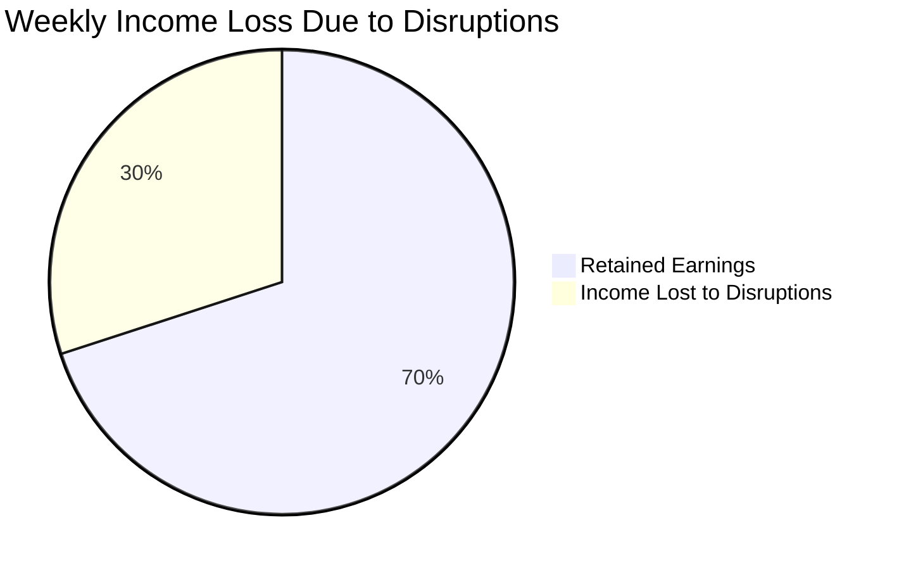
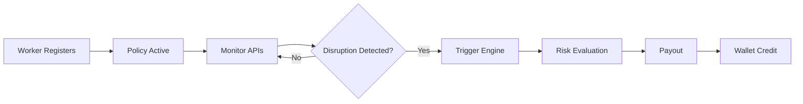
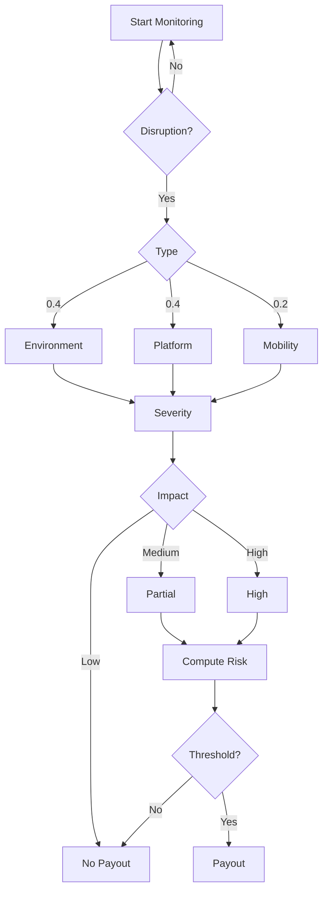
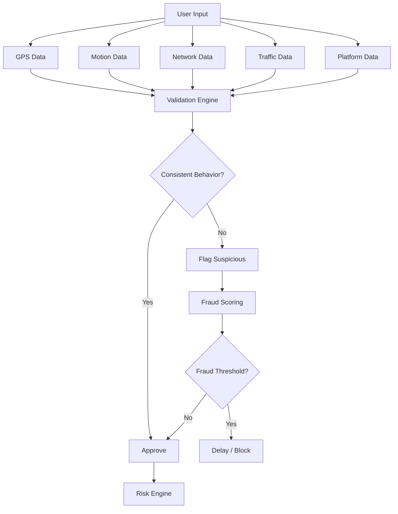

<div align="center">
  
</div>

<p align="center">
  <b>Phase 1 Strategy & System Concept</b><br>
  <i>A data-driven safety net for India's gig economy</i>
</p>

---

# 📌 Problem Statement

India’s gig economy relies on delivery partners who earn daily wages strictly based on completed deliveries.

However, workers face income loss due to uncontrollable external disruptions such as:

- Heavy Rain  
- Extreme Heatwaves  
- Severe Air Pollution  
- Mobility Restrictions (road blockages, restricted zones)  
- Platform Activity Anomalies  

During such events, workers may lose **20–30% of their weekly income**, and there is no real-time protection system.



---

# Why This Matters

India has over 7 million gig workers, heavily dependent on daily income.

Even short disruptions (1–2 days) can significantly impact financial stability.

KavachSathi addresses this gap using **automated parametric insurance**.

---

# Proposed Concept: KavachSathi

KavachSathi is a parametric micro-insurance system that eliminates manual claims using real-time external signals.

### Core Idea

If disruptions reduce earning capacity, the system automatically compensates income loss.

---

# Core System Pillars

### 1. Weekly Micro-Premiums
Aligned with gig workers’ earning cycle.

### 2. Algorithmic Risk Scoring
- Weather conditions  
- Platform activity (proxy-based)  
- Mobility constraints  

### 3. Zero-Touch Claims
No manual intervention.

### 4. Instant Wallet Payouts
Real-time compensation.

---

# Target User Persona

<p align="center">
  
</p>

---

# Workflow Scenario

Rahul earns ₹5000/week.

A disruption causes ₹1500 loss.

System:
1. Detects disruption  
2. Validates conditions  
3. Calculates risk  
4. Triggers payout  

Result: ₹800 credited instantly.

---

# Visual Workflow



---

# System Architecture

- Frontend: React / Next.js  
- Backend: Node.js  
- Database: MongoDB  
- AI Engine: Python (Scikit-learn)  
- APIs: Weather, Traffic  
- Payments: Razorpay Sandbox  

---

# Decision Engine (Core Innovation)

```text
Risk Score =
(Environment × 0.4) +
(Platform × 0.4) +
(Mobility × 0.2)
```

Weights reflect real-world impact on income and are dynamically adjustable.

### Payout Logic

```text
Risk > 70 → High Payout  
40–70 → Partial  
< 40 → No Payout  
```

---

# Decision Tree



---

# Parametric Triggers

| Category | Condition | Payout |
|----------|----------|--------|
| Rain | >60mm | ₹250 |
| Heat | >45°C | ₹200 |
| AQI | >400 | ₹150 |
| Platform | Demand drop / downtime | ₹350 |
| Mobility | Route blocked | ₹300 |

---

# 🚨 Adversarial Defense & Anti-Spoofing Strategy

## Core Principle

The system does not rely on GPS alone.

It validates **behavioral consistency across multiple independent signals**.

---

## Multi-Signal Validation

- GPS location  
- Device motion (accelerometer patterns)  
- Network signal behavior  
- Traffic API correlation  
- Platform activity (proxy-based demand patterns)  
- Historical user movement  
- Cluster detection (group fraud patterns)  

---

## Fraud Detection Model

```text
Fraud Score =
(Motion × 0.3) +
(Network × 0.2) +
(Location × 0.3) +
(Cluster × 0.2)
```

---

## Anti-Spoofing Architecture



---

## UX Balance

- Flagged claims are not instantly rejected  
- Delayed verification applied  
- Partial payout allowed  
- Repeated fraud triggers stricter checks  

---

# Premium Model

| Tier | Weekly | Coverage |
|------|-------|----------|
| Basic | ₹25 | ₹500 |
| Standard | ₹40 | ₹1000 |
| Pro | ₹60 | ₹1800 |

Premiums are calibrated for sustainability (loss ratio balance).

---

# Key Insight

KavachSathi does not insure events.

It insures **income impact caused by those events**.

---

# Development Roadmap

### Phase 1
- Concept + architecture  
- Trigger modeling  

### Phase 2
- API integration  
- Risk engine  

### Phase 3
- Automation  
- Fraud detection  
- Deployment  

---

# Team

| Member | Role |
|------|------|
| Eashan Darsh | System Architecture & Frontend |
| Ved Deshmukh | Research |
| Shashwat Chaturvedi | Backend |
| Sneha Basera | Data Collection |
| Asim Shankar | AI / ML |

---

# Vision

KavachSathi transforms insurance into a **real-time, data-driven protection system**.

From claim-based insurance to trigger-based protection.
