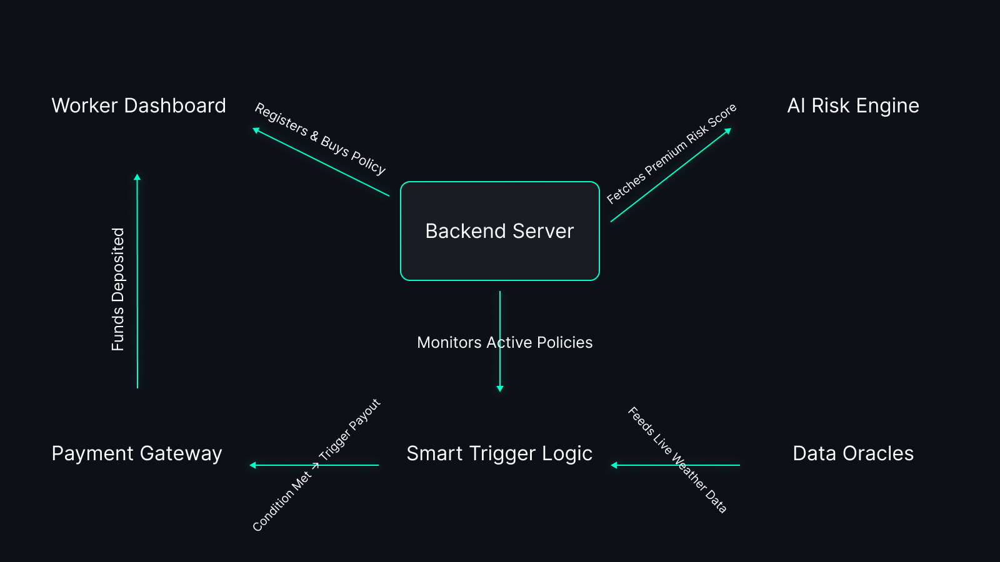

  

  <b>Phase 1 Strategy & System Concept</b> 
  <i>A data-driven safety net for India's gig economy</i>

---

## 🚨 Core Problem

India’s gig economy relies on delivery partners who earn daily wages strictly based on completed deliveries. However, uncontrollable external disruptions such as **heavy rain, extreme heatwaves, severe air pollution, or government curfews** can completely halt operations. 

During these events, workers lose **20–30% of their weekly income**. Currently, there is no financial safety net designed to protect against this specific type of environmental income loss.

---

## 💡 Proposed Concept: ShieldGig

ShieldGig is a proposed **parametric insurance system** engineered specifically for gig delivery workers. 

Instead of traditional, manual claim processing, ShieldGig relies on automated parametric triggers. Payouts are entirely data-driven, executing automatically when predefined environmental APIs cross critical thresholds.

**Core System Pillars:**
* **Weekly Micro-Premiums:** A subscription model synchronized with the standard gig worker payout cycle.
* **Algorithmic Risk Scoring:** Dynamic premium pricing based on localized weather forecasting and historical data.
* **Zero-Touch Claims:** API-driven event detection eliminates the need for manual claim filing.
* **Instant Wallet Payouts:** Direct financial relief triggered by the system architecture.

---

## 🎯 Target User Persona

For Phase 1, the system logic is optimized for **Food Delivery Partners**.

| Demographic | Worker Profile Data |
| :--- | :--- |
| **Primary Platforms** | Swiggy, Zomato |
| **Average Age** | 18–35 |
| **Daily Earnings** | ₹600 – ₹900 |
| **Payment Cycle** | Weekly |

### 📖 Workflow Scenario
Rahul is a delivery partner earning ₹5,000/week. A sudden monsoon floods his delivery zone, halting work for two days, resulting in a ₹1,500 income loss. 

**The ShieldGig Protocol:** The system backend detects the extreme rainfall via integrated weather APIs. The parametric smart-trigger evaluates the data, validates the condition, and automatically initiates an ₹800 payout to Rahul's wallet. 

---

## ⚙️ System Architecture Concept

  

1. **Client Interface:** Lightweight worker dashboard for policy registration.
2. **Backend Node:** Manages user states, active policies, and API polling intervals.
3. **Risk Engine:** Evaluates geographic and environmental data for premium calculation.
4. **Data Oracles:** External APIs (OpenWeather, Govt AQI monitors).
5. **Trigger Logic:** Evaluates incoming oracle data against predefined parametric rules.
6. **Payment Gateway:** Simulates the automated disbursement of funds.

---

## 📊 Parametric Triggers & Payout Logic

These thresholds ensure transparent, unbiased, and instantaneous system responses.

| Disruption Event | API Condition / Threshold | Automated Payout |
| :--- | :--- | :--- |
| 🌧 **Heavy Rain** | Rainfall > 50mm | ₹300 |
| 🌡 **Extreme Heat** | Temperature > 45°C | ₹200 |
| 🌊 **Flood Alert** | Govt API Flood Alert = True | ₹400 |
| 🌫 **Severe Pollution**| AQI > 400 | ₹150 |
| 🚧 **Curfew** | Geo-fenced Govt Restriction | ₹500 |

---

## 💰 Weekly Premium Model

Premiums are calculated weekly to match the user's financial cycle. The backend dynamically adjusts these rates depending on the specific location's risk profile.

| Tier | Base Weekly Premium | Max Income Coverage |
| :--- | :--- | :--- |
| **Basic** | ₹20/week | Up to ₹1000 |
| **Standard**| ₹35/week | Up to ₹2000 |
| **Pro** | ₹50/week | Up to ₹3500 |

---

## 🤖 AI & Logic Integration Strategy

**1. Risk Prediction Engine**
We plan to utilize machine learning models (Python, Scikit-learn) to analyze historical weather patterns and geographic flood zones. This generates a dynamic risk score for specific delivery grids.

**2. Dynamic Pricing Logic**
Premiums will automatically scale based on the generated risk score, ensuring fair pricing algorithms (e.g., lower risk zones yield cheaper premiums).

**3. Anomaly & Fraud Detection**
To prevent system abuse, the logic will cross-reference:
* GPS location validation against claimed disruption zones.
* Discrepancies between user-reported weather and actual API data.

---

## 💻 Proposed Technology Stack

* **Frontend:** React.js / Next.js
* **Backend:** Node.js + Express
* **Database:** MongoDB
* **Machine Learning:** Python, Scikit-learn
* **Data Integration:** OpenWeather API, AQI API
* **Financial Simulation:** Razorpay Sandbox

---

## 🚀 Development Roadmap

* **Phase 1 (Current):** Concept definition, architectural planning, and parametric trigger modeling.
* **Phase 2:** Core API integration, backend logic development, and risk engine training.
* **Phase 3:** Full system deployment, advanced fraud detection integration, and real-time payout testing.

---

## 👥 Team

* **Eashan Darsh** - System Architecture & Frontend
* **Ved Deshmukh** - Research
* **Shashwat Chaturvedi** - Backend
* **Sneha Basera** - Data Collection
* **Asim Shankar** - AI/ML
