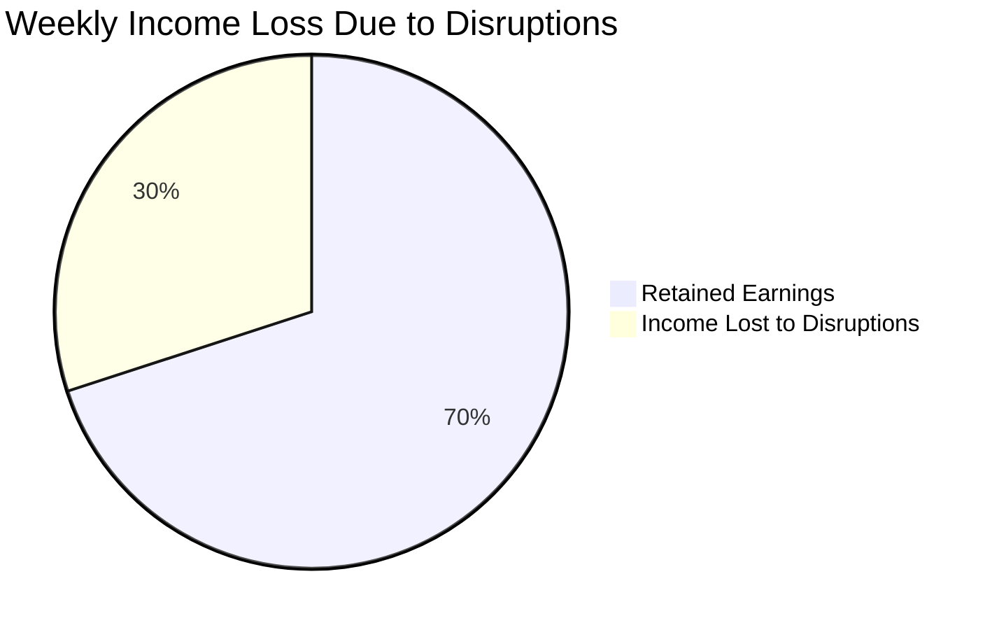
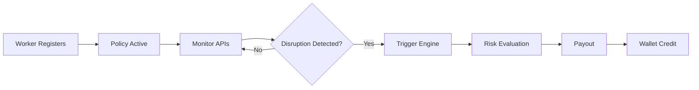
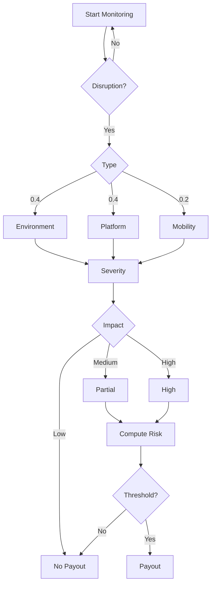
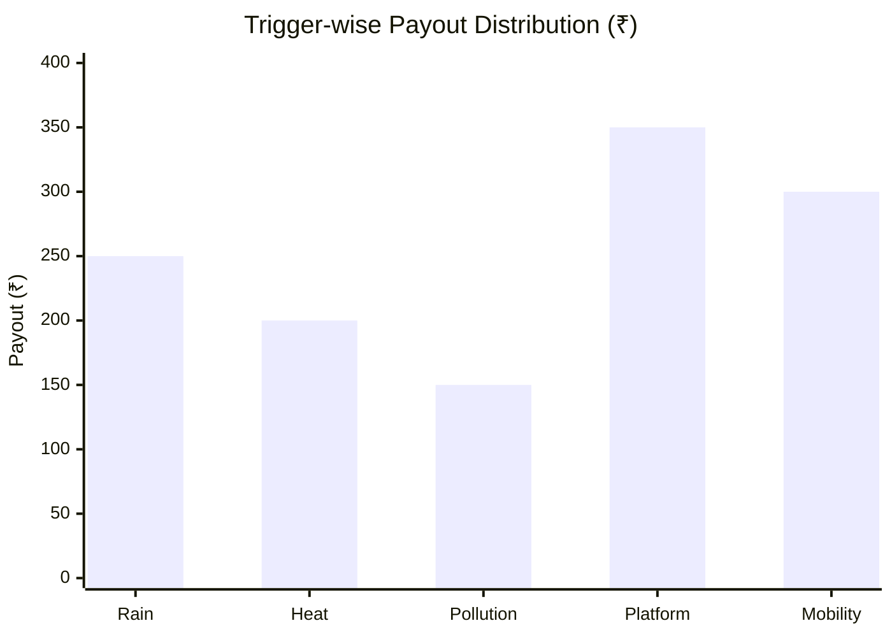

<div align="center">
  
</div>

<p align="center">
  <b>Phase 2 System Design & Execution</b><br>
  <i>A data-driven safety net for India's gig economy</i>
</p>

---

# Table of Contents

* [Problem Statement](#-problem-statement)
* [Why This Matters](#why-this-matters)
* [Proposed Concept](#proposed-concept-kavachsathi)
* [Core System Pillars](#core-system-pillars)
* [Target User Persona](#target-user-persona)
* [Workflow Scenario](#workflow-scenario)
* [System Architecture](#system-architecture)
* [Decision Engine](#decision-engine-core-innovation)
* [Decision Tree](#decision-tree)
* [Trigger Table](#trigger-table)

### Critical Evaluation Sections (Judge Focus)

* [Risk-Capping Mechanism](#risk-capping-mechanism)

* [Segment-Specific Insights](#segment-specific-insights)

* [Financial Viability Analysis](#financial-viability-analysis)

* [Exclusions and Regulatory Awareness](#exclusions-and-regulatory-awareness)

* [Adversarial Defense](#adversarial-defense--anti-spoofing-strategy)

* [Technology Stack](#technology-stack)

* [Development Roadmap](#development-roadmap)

* [Team](#team)

* [Vision](#vision)

---

# 📌 Problem Statement

India’s gig economy relies on delivery partners who earn daily wages strictly based on completed deliveries.

However, workers face income loss due to uncontrollable external disruptions such as:

* Heavy Rain
* Extreme Heatwaves
* Severe Air Pollution
* Mobility Restrictions
* Platform Activity Anomalies

During such events, workers may lose **20–30% of their weekly income**, and there is no real-time protection system.



---

# Why This Matters

India has over 7 million gig workers, heavily dependent on daily income.

Even short disruptions (1–2 days) can significantly impact financial stability.

KavachSathi addresses this gap using automated parametric insurance.

---

# Proposed Concept: KavachSathi

KavachSathi is a parametric micro-insurance system that eliminates manual claims using real-time external signals.

### Core Idea

If disruptions reduce earning capacity, the system automatically compensates income loss.

---

# Core System Pillars

1. Weekly Micro-Premiums
2. Algorithmic Risk Scoring
3. Zero-Touch Claims
4. Instant Wallet Payouts

---

# Target User Persona

<p align="center">
  
</p>

### User Personas

| Attribute         | Full-Time Earner      | Part-Time Earner    |
| ----------------- | --------------------- | ------------------- |
| Primary Goal      | Sustaining livelihood | Supplemental income |
| Weekly Earnings   | ₹5,000 - ₹8,000+      | ₹1,500 - ₹3,000     |
| Time on Road      | 10–12 hrs/day         | 3–5 hrs/day         |
| Premium Structure | Fixed weekly          | Usage-based         |
| Income Impact     | Severe                | Moderate            |

---

# Workflow Scenario

Rahul earns ₹5000/week.
A disruption causes ₹1500 loss.

System:

1. Detects disruption
2. Validates conditions
3. Calculates risk
4. Triggers payout

Result: ₹800 credited instantly.

---

# Visual Workflow



---

# System Architecture

<p align="center">
  
</p>

* Backend aggregates real-time signals from multiple data sources
* AI Risk Engine computes disruption impact score
* POP Validator performs fraud detection
* Smart Trigger Logic activates payouts
* Premium Engine dynamically adjusts pricing based on risk and loss ratio

---

# Decision Engine (Core Innovation)

```text
Risk Score = (Environment × 0.4) + (Platform × 0.4) + (Mobility × 0.2)
```

Risk Score is further constrained by system-level risk caps and segment-based adjustments before final payout decision.

### Example

Environment = 80
Platform = 60
Mobility = 40

Risk Score = 64 → Partial payout

### Payout Logic

```text
Risk > 70 → High Payout  
40–70 → Partial  
< 40 → No Payout  
```

---

# Decision Tree





---

# Trigger Table

| Category      | Trigger          | Condition              | Payout |
| ------------- | ---------------- | ---------------------- | ------ |
| Environmental | Heavy Rain       | Rainfall > 60mm        | ₹250   |
| Environmental | Extreme Heat     | Temperature > 45°C     | ₹200   |
| Environmental | Pollution        | AQI > 400              | ₹150   |
| Platform      | Activity Anomaly | Demand drop / downtime | ₹350   |
| Mobility      | Restriction      | Route blockage         | ₹300   |

---

# Risk-Capping Mechanism

* Weekly payout caps prevent over-exposure
* Event-level payout limits restrict abuse
* Frequency-based throttling for repeated triggers
* Loss ratio monitoring (target: 60–70%)
* If loss ratio > 85% → system restricts new policies

---

# Segment-Specific Insights

| Segment           | Insight                               |
| ----------------- | ------------------------------------- |
| Urban Workers     | Partial disruptions reduce efficiency |
| Rural Workers     | Disruptions cause total income loss   |
| Full-Time Workers | High dependency → higher protection   |
| Part-Time Workers | Flexible micro-coverage               |

Key insight: same disruption produces different economic impact across segments.

---

# Financial Viability Analysis

* Weekly Premium: ₹20–₹50
* Target Loss Ratio: 60–70%
* Expected Margin: 30–40%

Example:
1000 users × ₹40 = ₹40,000
Payout (65%) = ₹26,000
Margin = ₹14,000

Premium engine continuously adapts based on historical payout trends to maintain stable loss ratio.

---

# Exclusions and Regulatory Awareness

### Exclusions

* Health insurance
* Vehicle damage
* Personal accidents
* Non-disruption-related income loss

### Compliance

* Parametric insurance model
* Transparent trigger-based payouts
* Requires licensed insurer partnership (IRDAI compliance)

---

# Adversarial Defense & Anti-Spoofing Strategy

* Multi-signal validation (not GPS-only)
* Motion, network, traffic, platform data
* Behavioral consistency checks

```text
Fraud Score = (Motion × 0.3) + (Network × 0.2) + (Location × 0.3) + (Cluster × 0.2)
```

---

# Technology Stack

| Layer    | Technology       |
| -------- | ---------------- |
| Frontend | React / Next.js  |
| Backend  | Node.js          |
| Database | MongoDB          |
| AI       | Python           |
| APIs     | Weather, Traffic |
| Payments | Razorpay         |

---

# Development Roadmap

Phase 1 → Concept
Phase 2 → API + Risk Engine
Phase 3 → Automation + Deployment

---

# Team

| Member              | Role                |
| ------------------- | ------------------- |
| Eashan Darsh        | System Architecture |
| Ved Deshmukh        | Research            |
| Shashwat Chaturvedi | Backend             |
| Sneha Basera        | Data                |
| Asim Shankar        | AI                  |

---

# Vision

KavachSathi transforms insurance into a real-time, data-driven protection system.

From claim-based insurance to trigger-based protection.
