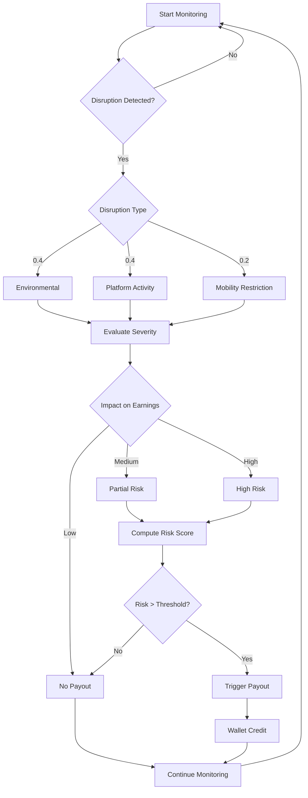

<div align="center">
  
</div>

<p align="center">
  <b>Phase 1 Strategy & System Concept</b><br>
  <i>A data-driven safety net for India's gig economy</i>
</p>

---

# 📌 Problem Statement

India’s gig economy relies on delivery partners who earn daily wages based on completed deliveries.

Income is vulnerable to **external disruptions** such as:

- Heavy Rain  
- Extreme Heatwaves  
- Severe Air Pollution  
- Mobility Restrictions  
- Platform Activity Anomalies  

These events can reduce weekly income by **20–30%**, with no existing real-time protection system.

---

# Proposed Concept

ShieldGig is a **parametric micro-insurance system** that automates income protection using real-time external signals.

Unlike traditional insurance, ShieldGig eliminates claim delays by using **predefined parametric triggers**, enabling **instant and unbiased payouts**.

---

# Core Mechanism

The system converts real-world disruptions into **quantified income risk**, then triggers payouts automatically.

---

# Decision Engine (Core Innovation)

ShieldGig uses a **multi-factor weighted decision model**, not simple rule-based triggers.

```text
Risk Score =
(Environment × 0.4) +
(Platform × 0.4) +
(Mobility × 0.2)
```

Weights are dynamically adjusted using historical correlation between disruptions and income loss.

### Payout Logic

```text
Risk > 70 → High Payout  
40–70 → Partial Payout  
< 40 → No Payout  
```

---

# Decision Tree Model



---

# Parametric Triggers

| Category | Trigger | Condition | Payout |
|----------|--------|----------|--------|
| Environmental | Rain | Rainfall > 60mm | ₹250 |
| Environmental | Heat | Temperature > 45°C | ₹200 |
| Environmental | Pollution | AQI > 400 | ₹150 |
| Platform | Activity Anomaly | Proxy-based demand drop / downtime | ₹350 |
| Mobility | Restriction | Route blockage / restricted zone | ₹300 |

---

# Data & Feasibility

- Weather → Public APIs  
- Mobility → Traffic APIs  
- Platform signals → **Proxy indicators (order density, time-based demand simulation)**  

This ensures feasibility without relying on proprietary platform data.

---

# Risk & Pricing Logic

Premiums are calibrated to maintain a **balanced loss ratio**, ensuring system sustainability.

| Tier | Weekly Premium | Coverage |
|------|--------------|----------|
| Basic | ₹25 | ₹500 |
| Standard | ₹40 | ₹1000 |
| Pro | ₹60 | ₹1800 |

---

# Fraud Prevention

- GPS-based location validation  
- Cross-verification with API data  
- Duplicate claim prevention  

Example: Claims from unaffected zones are automatically rejected.

---

# System Architecture

- Frontend: React / Next.js  
- Backend: Node.js  
- Database: MongoDB  
- AI: Python (Scikit-learn)  
- APIs: Weather, Traffic  
- Payments: Razorpay Sandbox  

---

# Key Insight

ShieldGig does not insure events.

It insures **income impact caused by those events**.

---

# Vision

From claim-based insurance to **trigger-based protection**.
