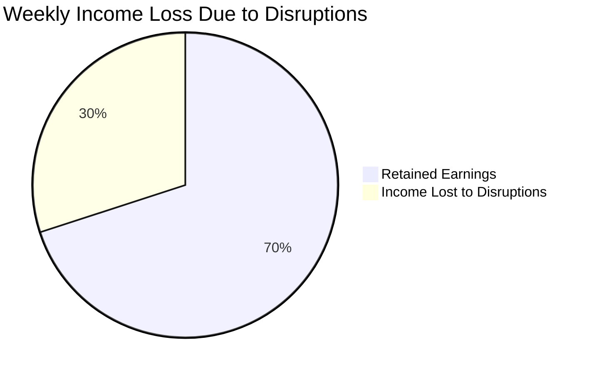
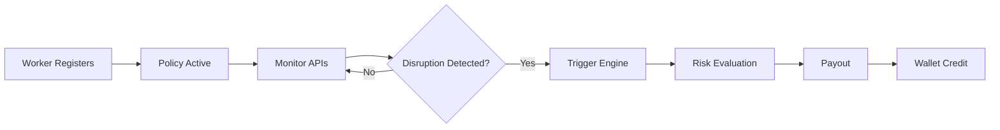

<div align="center">
  
</div>

<p align="center">
  <b>Phase 2 System Design & Execution</b><br>
  <i>A data-driven safety net for India's gig economy</i>
</p>

---

# Table of Contents

| **PHASE 1 – System Foundation**                                     | **PHASE 2 – Execution & Evaluation**                                        |
| ------------------------------------------------------------------- | --------------------------------------------------------------------------- |
| [Problem Statement](#-problem-statement)                            | [Registration Process](#registration-process)                               |
| [Why This Matters](#why-this-matters)                               | [Insurance Policy Management](#insurance-policy-management)                 |
| [Proposed Concept](#proposed-concept-kavachsathi)                   | [Dynamic Premium Calculation](#dynamic-premium-calculation)                 |
| [Core System Pillars](#core-system-pillars)                         | [Claims Management](#claims-management)                                     |
| [Target User Persona](#target-user-persona)                         | [Risk-Capping Mechanism](#risk-capping-mechanism)                           |
| [Workflow Scenario](#workflow-scenario)                             | [Segment-Specific Insights](#segment-specific-insights)                     |
| [System Architecture](#system-architecture)                         | [Financial Viability Analysis](#financial-viability-analysis)               |
| [Decision Engine](#decision-engine-core-innovation)                 | [Exclusions and Regulatory Awareness](#exclusions-and-regulatory-awareness) |
| [Decision Tree](#decision-tree)                                     |                                                                             |
| [Trigger Table](#trigger-table)                                     |                                                                             |
| [Adversarial Defense](#adversarial-defense--anti-spoofing-strategy) |                                                                             |
| [Technology Stack](#technology-stack)                               |                                                                             |
| [Development Roadmap](#development-roadmap)                         |                                                                             |
| [Team](#team)                                                       |                                                                             |
| [Vision](#vision)                                                   |                                                                             |

---

# 📌 Problem Statement

India’s gig economy relies on delivery partners who earn daily wages strictly based on completed deliveries.

However, workers face income loss due to uncontrollable external disruptions such as:

* Heavy Rain
* Extreme Heatwaves
* Severe Air Pollution
* Mobility Restrictions
* Platform Activity Anomalies

During such events, workers may lose **20–30% of their weekly income**, and there is no real-time protection system.



---

# Why This Matters

India has over 7 million gig workers, heavily dependent on daily income.

Even short disruptions (1–2 days) can significantly impact financial stability.

KavachSathi addresses this gap using automated parametric insurance.

---

# Proposed Concept: KavachSathi

KavachSathi is a parametric micro-insurance system that eliminates manual claims using real-time external signals.

If disruptions reduce earning capacity, the system automatically compensates income loss.

---

# Core System Pillars

1. Weekly Micro-Premiums
2. Algorithmic Risk Scoring
3. Zero-Touch Claims
4. Instant Wallet Payouts

---

# Target User Persona

<p align="center">
  
</p>

### User Personas

| Attribute         | Full-Time Earner      | Part-Time Earner    |
| ----------------- | --------------------- | ------------------- |
| Primary Goal      | Sustaining livelihood | Supplemental income |
| Weekly Earnings   | ₹5,000 - ₹8,000+      | ₹1,500 - ₹3,000     |
| Time on Road      | 10–12 hrs/day         | 3–5 hrs/day         |
| Premium Structure | Fixed weekly          | Usage-based         |
| Income Impact     | Severe                | Moderate            |

---

# Workflow Scenario

Rahul earns ₹5000/week.
A disruption causes ₹1500 loss.

System:

1. Detects disruption
2. Validates conditions
3. Calculates risk
4. Triggers payout

Result: ₹800 credited instantly.

---

# Visual Workflow



---

# System Architecture

<p align="center">
  
</p>

* Backend aggregates real-time signals
* AI Risk Engine computes disruption impact
* POP Validator ensures authenticity
* Smart Trigger Logic executes payout
* Premium Engine dynamically adjusts pricing

---

# Decision Engine (Core Innovation)

```text
Risk Score = (Environment × 0.4) + (Platform × 0.4) + (Mobility × 0.2)
```

Risk Score is constrained by system-level caps and segmentation before payout.

---

# Decision Tree

(keep your existing diagram)

---

# Trigger Table

(keep your existing table)

---

# =========================

# 🔷 PHASE 2 – EXECUTION FLOW

# =========================

---

# Registration Process

User onboarding captures:

* Location
* Work type
* Activity pattern

<p align="center">
  
</p>

---

# Insurance Policy Management

Dashboard displays:

* Active policy
* Weekly premium
* Coverage limits
* Risk level

<p align="center">
  
</p>

---

# Dynamic Premium Calculation

Premium dynamically adjusts using:

* Risk score
* Zone safety
* Historical disruptions

Example: safer zone → lower premium

<p align="center">
  
</p>

---

# Claims Management

Automated claim lifecycle:

1. Trigger detected
2. Policy verified
3. Fraud validation
4. Payout processed

<p align="center">
  
</p>

---

# Risk-Capping Mechanism

* Weekly caps
* Event caps
* Loss ratio monitoring
* Auto-stop if >85%

---

# Segment-Specific Insights

* Urban → partial loss
* Rural → total loss
* Full-time → high protection
* Part-time → flexible coverage

---

# Financial Viability Analysis

* Premium: ₹20–₹50
* Loss ratio: 60–70%

Example:
1000 users → ₹40,000
Payout → ₹26,000
Profit → ₹14,000

---

# Exclusions and Regulatory Awareness

### Exclusions

* Health
* Vehicle damage
* Non-disruption loss

### Compliance

* Parametric insurance model
* IRDAI-aligned

---

# Adversarial Defense & Anti-Spoofing Strategy

* Multi-signal validation
* Behavioral consistency checks

```text
Fraud Score = (Motion × 0.3) + (Network × 0.2) + (Location × 0.3) + (Cluster × 0.2)
```

---

# Technology Stack

| Layer    | Technology       |
| -------- | ---------------- |
| Frontend | React / Next.js  |
| Backend  | Node.js          |
| Database | MongoDB          |
| AI       | Python           |
| APIs     | Weather, Traffic |
| Payments | Razorpay         |

---

# Development Roadmap

Phase 1 → Concept
Phase 2 → API + Risk Engine
Phase 3 → Automation

---

# Team

| Member              | Role                |
| ------------------- | ------------------- |
| Eashan Darsh        | System Architecture |
| Ved Deshmukh        | Research            |
| Shashwat Chaturvedi | Backend             |
| Sneha Basera        | Data                |
| Asim Shankar        | AI                  |

---

# Vision

KavachSathi transforms insurance into real-time protection.

---
