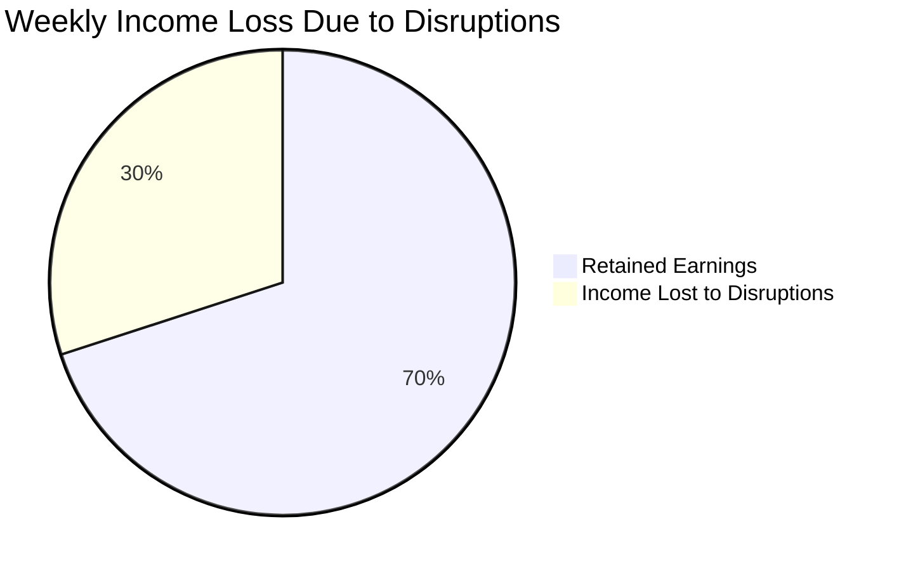
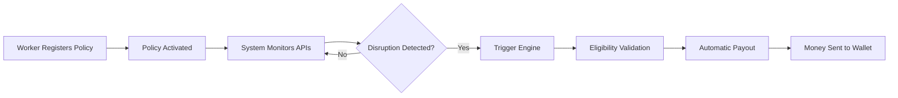
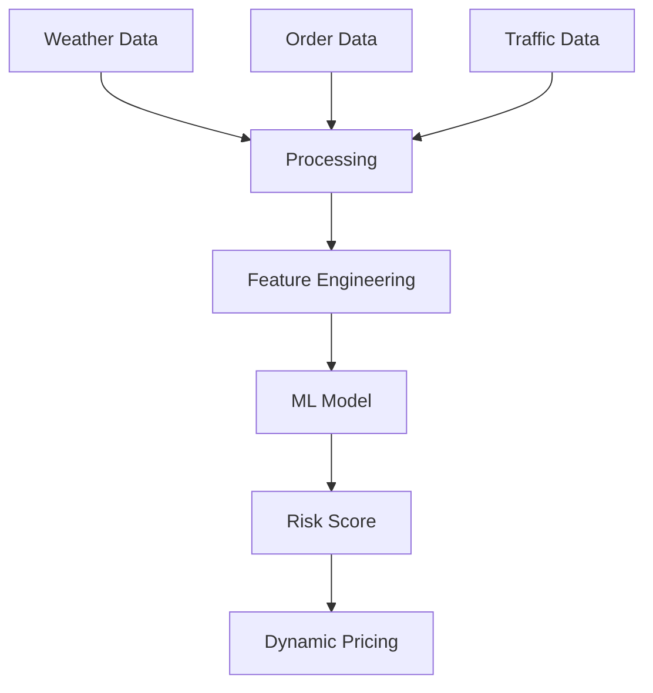
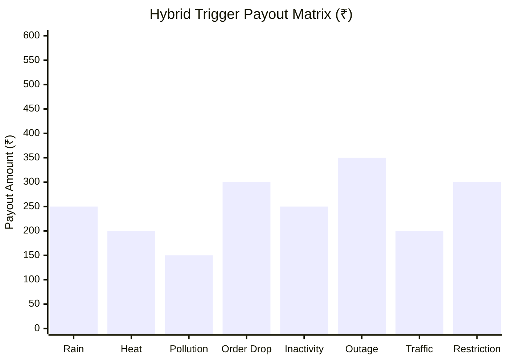

<div align="center">
  
</div>

<p align="center">
  <b>Phase 1 Strategy & System Concept</b><br>
  <i>A data-driven safety net for India's gig economy</i>
</p>

---

# 📌 Problem Statement

India’s gig economy relies on *delivery partners* who earn daily wages strictly based on completed deliveries.

However, workers face income loss due to *uncontrollable environmental and operational disruptions* such as:

- Heavy Rain  
- Extreme Heatwaves  
- Severe Air Pollution  
- Mobility restrictions (road blockages, restricted zones)  
- Sudden drop in order demand  
- Platform downtime  

During such events, workers may lose **20–30% of their weekly income**, and currently there is **no dedicated protection system** for this type of disruption.



---

# Why This Matters

India currently has *7+ million gig workers*, and the number is growing rapidly with platforms like **Swiggy, Zomato, Blinkit, and Zepto**.

Most of these workers depend on *daily earnings to survive*, meaning even **1–2 days of disruption** can significantly affect their financial stability.

Disruptions such as:

- Environmental conditions  
- Demand fluctuations  
- Platform outages  
- Mobility restrictions  

can *instantly halt deliveries*, leaving workers without income.

ShieldGig aims to create a *financial safety net* that protects gig workers from these unpredictable events through *automated parametric insurance*.

---

# Proposed Concept: ShieldGig

*ShieldGig* is a *parametric micro-insurance platform* designed specifically for gig delivery workers.

Instead of traditional manual claim processes, the system uses *automated data-driven triggers* powered by APIs.

When certain conditions are met, *payouts are automatically triggered*.

### Core Idea

If real-world conditions reduce earning opportunities, the system *automatically compensates a portion of lost income.*

---

# Core System Pillars

### 1️. Weekly Micro-Premiums

A subscription model aligned with the *weekly payout cycle* of gig workers.

### 2️. Algorithmic Risk Scoring

Premiums dynamically adjust using:

- Weather forecasts  
- Demand trends  
- Mobility conditions  

### 3️. Zero-Touch Claims

No paperwork or claim forms.

The system automatically detects disruptions using *external data APIs*.

### 4️. Instant Wallet Payouts

Compensation is credited directly to the *worker’s digital wallet*.

---

# Target User Persona

Phase 1 focuses on *Food Delivery Partners*.

<p align="center">
  
</p>

---

# Workflow Scenario

### Example Case

Rahul is a delivery partner earning *₹5000 per week*.

A sudden disruption reduces available delivery orders for two days, causing **₹1500 income loss**.

### ShieldGig Protocol

1. System detects abnormal drop in activity or external disruption  
2. Parametric condition is validated  
3. System automatically initiates payout  
4. Rahul receives *₹800 compensation instantly*  

No manual claim required.

---

# Visual System Workflow



---

# System Architecture

<p align="center">

</p>

### Architecture Components

*Client Interface*

- Worker dashboard  
- Policy registration  
- Coverage tracking  

*Backend Node*

- Policy management  
- API polling  
- Event monitoring  

*Risk Engine*

- Calculates composite risk scores  
- Determines dynamic premium pricing  

*Data Oracles*

- Weather APIs  
- Demand signals  
- Traffic / mobility data  
- Platform status  

*AI Agent*

Generates dynamic risk predictions.

*Trigger Engine*

Evaluates real-time data against defined rules.

*Payment Gateway*

Simulated payout system.

---

# AI Decision Flow



---

# Parametric Triggers & Payout Logic



## Parametric Triggers & Payout Logic

| Category | Trigger | Condition | Payout |
|----------|--------|----------|--------|
| Environmental | Heavy Rain | Rainfall > 60mm | ₹250 |
| Environmental | Extreme Heat | Temperature > 45°C | ₹200 |
| Environmental | Pollution | AQI > 400 | ₹150 |
| Demand | Order Drop | Orders drop > 40% in zone | ₹300 |
| Demand | Zone Inactivity | No orders for 2+ hours | ₹250 |
| Platform | Outage | Platform downtime detected | ₹350 |
| Mobility | Traffic Lockdown | Congestion exceeds threshold | ₹200 |
| Access | Route Restriction | Area inaccessible due to blockage | ₹300 |

---

### Dynamic Risk Score

```
Risk Score = (Weather Factor × 0.4) + (Demand Factor × 0.4) + (Mobility Factor × 0.2)
```

---

# Weekly Premium Model

| Tier     | Weekly Premium | Max Weekly Coverage | Per Event Cap | Best For |
|----------|---------------|---------------------|---------------|----------|
| Basic    | ₹25           | Up to ₹500          | ₹150–₹200     | Low-risk areas |
| Standard | ₹40           | Up to ₹1000         | ₹250–₹300     | Moderate-risk users |
| Pro      | ₹60           | Up to ₹1800         | Up to ₹400    | High-risk zones |

Premiums dynamically adjust based on *risk score and real-time conditions*.

---

# AI & Logic Integration Strategy

### 1️. Risk Prediction Engine

- Weather patterns  
- Demand fluctuations  
- Traffic conditions  

**Tech:** Python, Scikit-learn  

---

### 2️. Dynamic Pricing Logic

- Risk score  
- Area conditions  
- Historical patterns  

---

### 3️. Fraud Detection

- Location validation  
- Data cross-verification  
- Pattern detection  

---

# Technology Stack

| Layer | Technology |
|------|-----------|
| Frontend | React.js / Next.js |
| Backend | Node.js + Express |
| Database | MongoDB |
| AI / ML | Python, Scikit-learn |
| APIs | Weather, Traffic, Platform APIs |
| Payment Simulation | Razorpay Sandbox |

---

# Development Roadmap

### Phase 1
- Concept design  
- Architecture planning  
- Parametric modeling  

### Phase 2
- Backend + APIs  
- Risk engine  

### Phase 3
- Automation  
- Fraud detection  
- Deployment  

---

# Team

| Member | Role |
|------|------|
| *Eashan Darsh* | System Architecture & Frontend |
| *Ved Deshmukh* | Research |
| *Shashwat Chaturvedi* | Backend |
| *Sneha Basera* | Data Collection |
| *Asim Shankar* | AI / ML |

---

# Vision

ShieldGig aims to become the *first automated income protection system for gig workers*.

ShieldGig converts insurance into a *real-time, data-driven financial safety net*.
