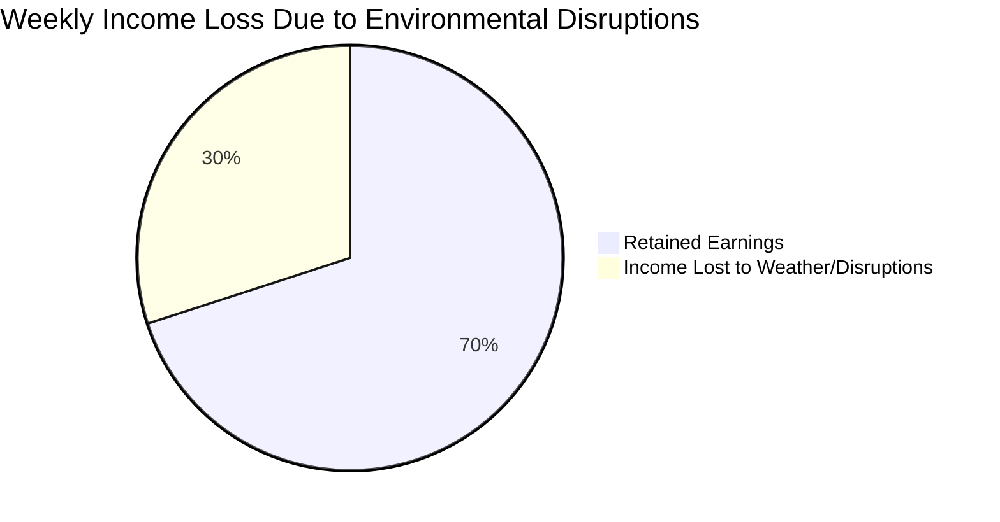

  

  <b>Phase 1 Strategy & System Concept</b> 
  <i>A data-driven safety net for India's gig economy</i>

---

# 📌 Problem Statement

India’s gig economy relies on **delivery partners** who earn daily wages strictly based on completed deliveries.

However, workers face income loss due to **uncontrollable environmental disruptions** such as:

- 🌧 Heavy Rain  
- 🌡 Extreme Heatwaves  
- 🌫 Severe Air Pollution  
- 🚧 Government Curfews  
- 🌊 Flood Alerts  

During such events, workers may lose **20–30% of their weekly income**, and currently there is **no dedicated protection system** for this type of disruption.

---

# Why This Matters

India currently has **7+ million gig workers**, and the number is growing rapidly with platforms like **Swiggy, Zomato, Blinkit, and Zepto**.

Most of these workers depend on **daily earnings to survive**, meaning even **1–2 days of disruption** can significantly affect their financial stability.

Environmental disruptions such as:

- Floods
- Heatwaves
- Severe pollution
- Government restrictions

can **instantly halt deliveries**, leaving workers without income.

ShieldGig aims to create a **financial safety net** that protects gig workers from these unpredictable events through **automated parametric insurance**.

---

# Proposed Concept: ShieldGig

**ShieldGig** is a **parametric micro-insurance platform** designed specifically for gig delivery workers.

Instead of traditional manual claim processes, the system uses **automated environmental triggers** powered by trusted APIs.

When certain environmental thresholds are crossed, **payouts are automatically triggered**.

### Core Idea

If environmental conditions stop gig workers from working, the system **automatically compensates a portion of their lost income.**

---

# Core System Pillars

### 1️ Weekly Micro-Premiums

A subscription model aligned with the **weekly payout cycle** of gig workers.

### 2️ Algorithmic Risk Scoring

Premiums dynamically adjust using:

- Weather forecasts
- Historical disruption data
- Geographic vulnerability analysis

### 3️ Zero-Touch Claims

No paperwork or claim forms.

The system automatically detects disruptions using **external data APIs**.

### 4️ Instant Wallet Payouts

Compensation is credited directly to the **worker’s digital wallet**.

---

# Target User Persona

Phase 1 focuses on **Food Delivery Partners**.

| Category | Details |
|--------|--------|
| Platforms | Swiggy, Zomato |
| Age Group | 18–35 |
| Daily Earnings | ₹600 – ₹900 |
| Payment Cycle | Weekly |

---

  

