<div align="center">
  
</div>

<p align="center">
  <b>Phase 3 Intelligence, Automation & Scale</b><br>
  <i>A data-driven safety net for India's gig economy</i>
</p>

---

# Table of Contents

| **PHASE 1 – System Foundation**                     | **PHASE 2 – Execution & Evaluation**                                        | **PHASE 3 – Intelligence & Scale**                        |
| --------------------------------------------------- | --------------------------------------------------------------------------- | --------------------------------------------------------- |
| [Problem Statement](#-problem-statement)            | [Registration Process](#registration-process)                               | [Advanced Fraud Detection](#advanced-fraud-detection)     |
| [Why This Matters](#why-this-matters)               | [Insurance Policy Management](#insurance-policy-management)                 | [Instant Payout System](#instant-payout-system-simulated) |
| [Proposed Concept](#proposed-concept-kavachsathi)   | [Dynamic Premium Calculation](#dynamic-premium-calculation)                 | [Intelligent Dashboard](#intelligent-dashboard)           |
| [Core System Pillars](#core-system-pillars)         | [Claims Management](#claims-management)                                     | [Worker Dashboard](#worker-dashboard)                     |
| [Target User Persona](#target-user-persona)         | [Risk-Capping Mechanism](#risk-capping-mechanism)                           | [Admin Dashboard](#admin-dashboard)                       |
| [Workflow Scenario](#workflow-scenario)             | [Segment-Specific Insights](#segment-specific-insights)                     | [Zero-Touch Claim Workflow](#zero-touch-claim-workflow)   |
| [System Architecture](#system-architecture)         | [Financial Viability Analysis](#financial-viability-analysis)               | [Local Setup & Installation](#local-setup--installation)  |
| [Decision Engine](#decision-engine-core-innovation) | [Exclusions and Regulatory Awareness](#exclusions-and-regulatory-awareness) | [IRDAI Compliance](#irdai-compliance)                     |
| [Decision Tree](#decision-tree)                     | [Technology Stack](#technology-stack)                                       | [Development Roadmap](#development-roadmap)               |
| [Trigger Table](#trigger-table)                     | [Team](#team)                                                               | [Vision](#vision)                                         |

---

# 📌 Problem Statement

India’s gig economy relies on delivery partners who earn daily wages strictly based on completed deliveries.

However, workers face income loss due to uncontrollable external disruptions such as:

* Heavy Rain
* Extreme Heatwaves
* Severe Air Pollution
* Mobility Restrictions
* Platform Activity Anomalies

During such events, workers may lose **20–30% of their weekly income**, and there is no real-time protection system.

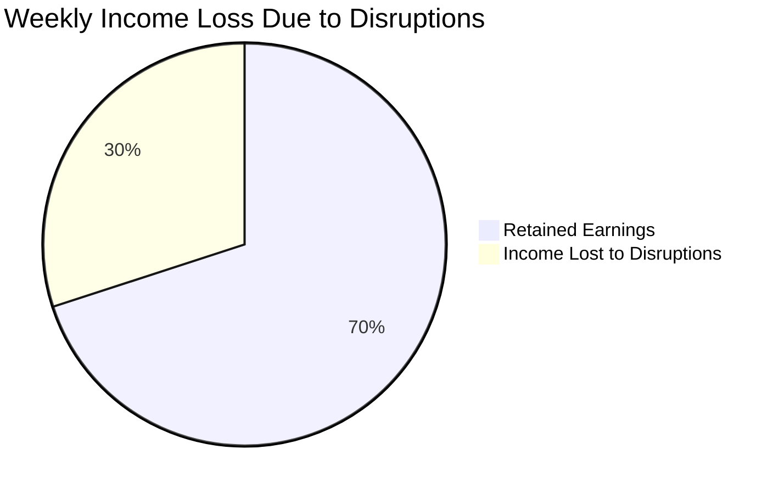

---

# Why This Matters

India has over 7 million gig workers heavily dependent on daily income.

Even short disruptions (1–2 days) can significantly impact financial stability.

KavachSathi addresses this gap using automated parametric insurance.

---

# Proposed Concept: KavachSathi

KavachSathi is a parametric micro-insurance system that eliminates manual claims using real-time external signals.

If disruptions reduce earning capacity, the system automatically compensates income loss.

---

# Core System Pillars

1. Weekly Micro-Premiums
2. Algorithmic Risk Scoring
3. Zero-Touch Claims
4. Instant Wallet Payouts

---

# Target User Persona

<p align="center">
  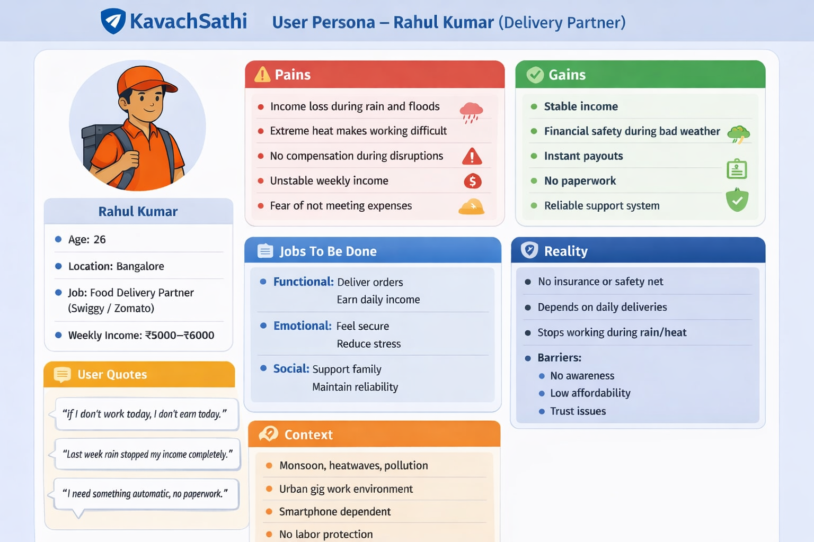
</p>

| Attribute         | Full-Time Earner      | Part-Time Earner    |
| ----------------- | --------------------- | ------------------- |
| Primary Goal      | Sustaining livelihood | Supplemental income |
| Weekly Earnings   | ₹5,000 - ₹8,000+      | ₹1,500 - ₹3,000     |
| Time on Road      | 10–12 hrs/day         | 3–5 hrs/day         |
| Premium Structure | Fixed weekly          | Usage-based         |
| Income Impact     | Severe                | Moderate            |

---

# Workflow Scenario

Rahul earns ₹5000/week.
A disruption causes ₹1500 loss.

System:

1. Detects disruption
2. Validates conditions
3. Calculates risk
4. Triggers payout

Result: ₹800 credited instantly.

---

# Visual Workflow

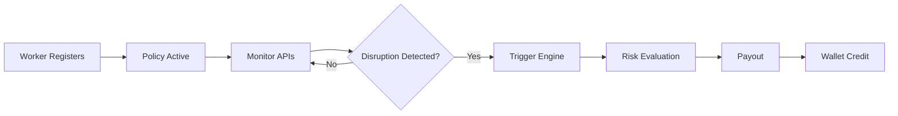

---

# System Architecture

<p align="center">
  
</p>

* Backend aggregates real-time signals
* AI Risk Engine computes disruption impact
* POP Validator ensures authenticity
* Smart Trigger Logic executes payout
* Premium Engine dynamically adjusts pricing

---

# Decision Engine (Core Innovation)

```text
Risk Score = (Environment × 0.4) + (Platform × 0.4) + (Mobility × 0.2)
```

Risk Score is constrained by caps and segmentation before payout.

### Example

Environment = 80
Platform = 60
Mobility = 40

Risk Score = 64 → Partial payout

### Payout Logic

```text
Risk > 70 → High Payout
40–70 → Partial
< 40 → No Payout
```

---

# Decision Tree

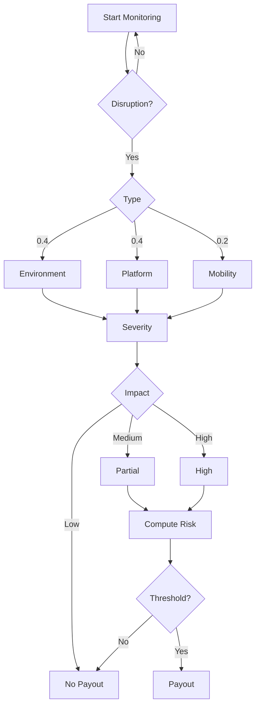

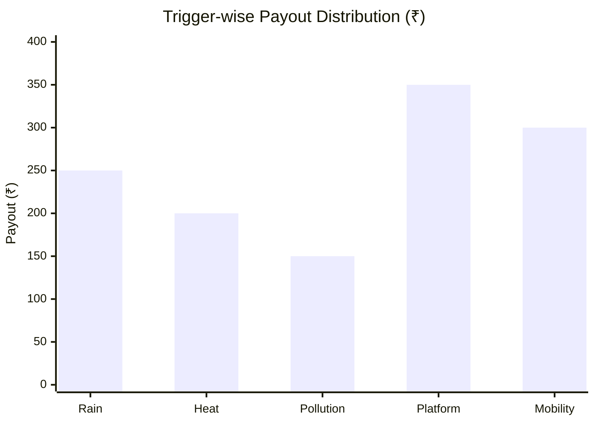

---

# Trigger Table

| Category      | Trigger          | Condition              | Payout |
| ------------- | ---------------- | ---------------------- | ------ |
| Environmental | Heavy Rain       | Rainfall > 60mm        | ₹250   |
| Environmental | Extreme Heat     | Temperature > 45°C     | ₹200   |
| Environmental | Pollution        | AQI > 400              | ₹150   |
| Platform      | Activity Anomaly | Demand drop / downtime | ₹350   |
| Mobility      | Restriction      | Route blockage         | ₹300   |

---

# 🔷 PHASE 2 – EXECUTION FLOW

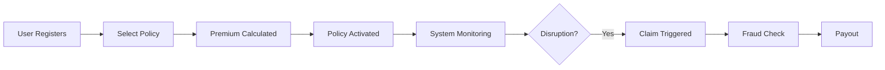

---

# Registration Process

* User enters location and work profile
* System initializes risk baseline

<p align="center">
  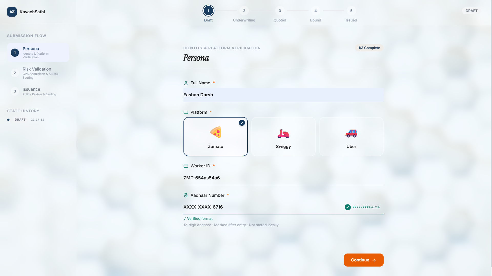
</p>

---

# Insurance Policy Management

* Active policy
* Weekly premium
* Coverage limits
* Risk status

<p align="center">
  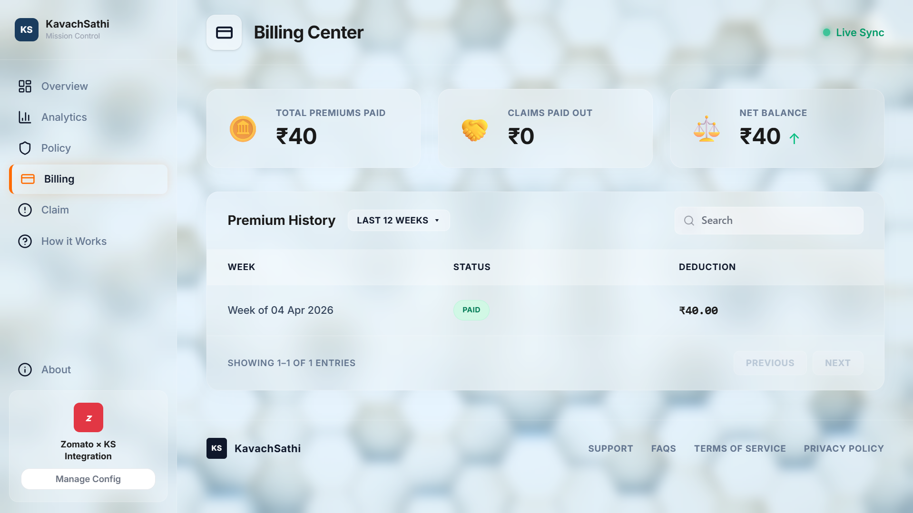
</p>

<p align="center">
  <a href="images/policy.pdf" target="_blank">View Full Policy PDF</a>
</p>

---

# Dynamic Premium Calculation

* Based on risk score
* Adjusts by geography and history

<p align="center">
  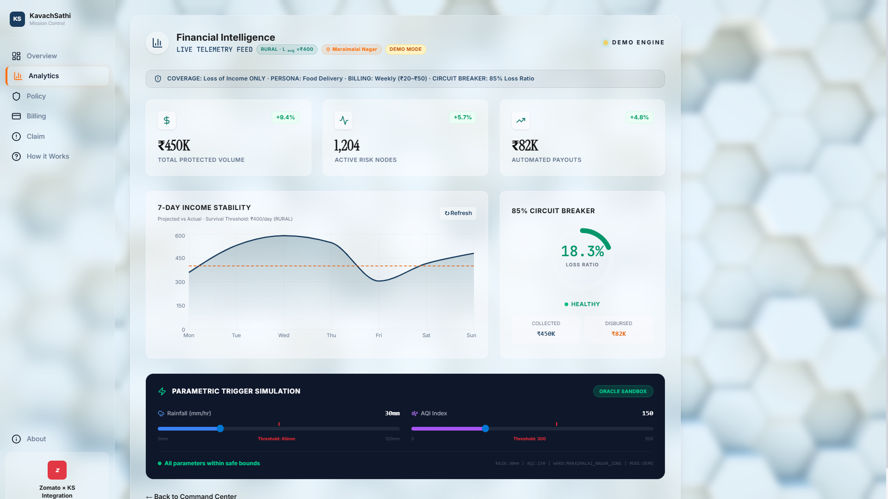
</p>

---

# Claims Management

1. Trigger detected
2. Policy validated
3. Fraud checked
4. Payout executed

<p align="center">
  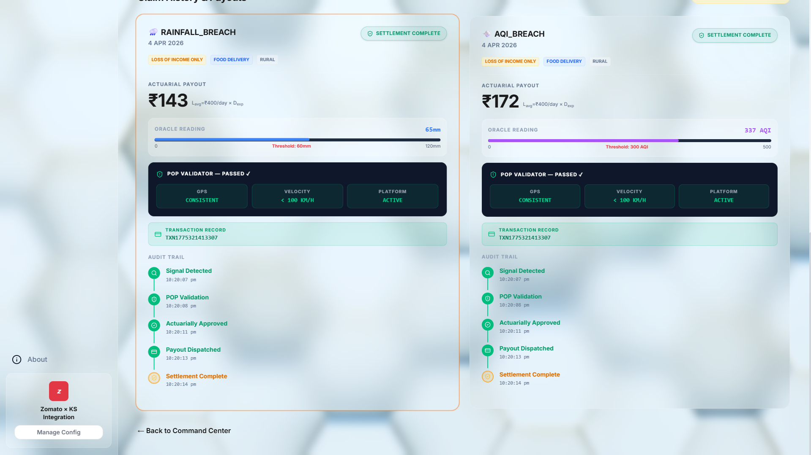
</p>

---

# Risk-Capping Mechanism

* Weekly caps
* Event caps
* Loss ratio monitoring
* Auto-stop if >85% payout ratio

---

# Segment-Specific Insights

* Urban workers → partial disruption patterns
* Rural workers → higher route dependency
* Full-time workers → high income dependency
* Part-time workers → flexible earnings model

---

# Financial Viability Analysis

* Premium: ₹20–₹50
* Loss ratio target: 60–70%

Example:

1000 users → ₹40,000
Payout → ₹26,000
Profit → ₹14,000

---

# Exclusions and Regulatory Awareness

### Exclusions

* Health claims
* Vehicle damage
* Intentional misuse
* Non-disruption income loss

### Compliance

* Parametric insurance aligned structure
* Transparent triggers
* Audit-ready logs

---

# Adversarial Defense & Anti-Spoofing Strategy

```text
Fraud Score = (Motion × 0.3) + (Network × 0.2) + (Location × 0.3) + (Cluster × 0.2)
```

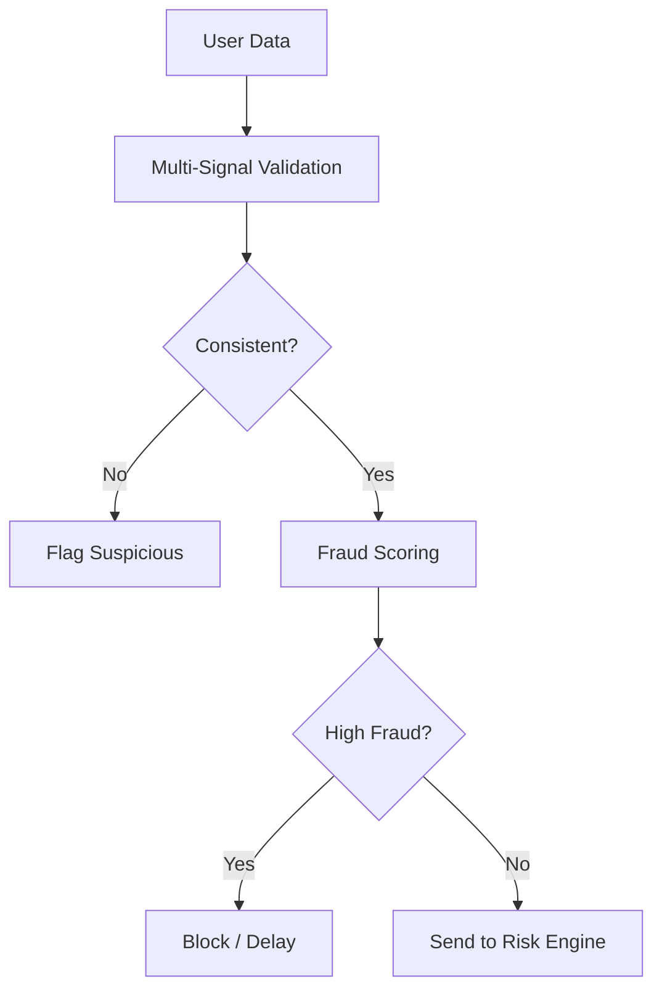

---

# 🔷 PHASE 3 – INTELLIGENCE & SCALE

# Advanced Fraud Detection

* GPS spoof detection
* Device fingerprint mismatch detection
* Impossible speed / route anomaly detection
* Same device multi-account claim detection
* Repeated suspicious trigger behavior analysis
* Cluster fraud analytics across zones

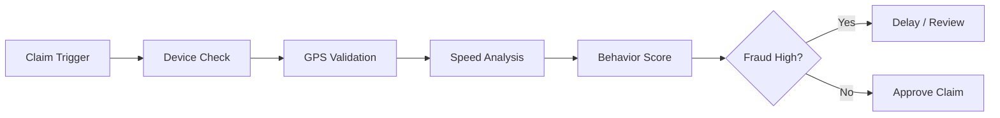

---

# Instant Payout System (Simulated)

* Auto payout after trigger + fraud clearance
* Razorpay-based simulated transfer flow
* Wallet balance updated instantly
* Claim receipt generated
* SMS / Email / WhatsApp alert sent

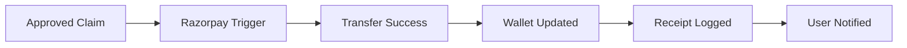

---

# Intelligent Dashboard

Unified analytics layer for workers and insurers.

---

# Worker Dashboard

* Earnings protected till date
* Active weekly coverage
* Current premium due
* Claim history
* Risk alerts for next 24h
* Wallet payout history

<p align="center">
  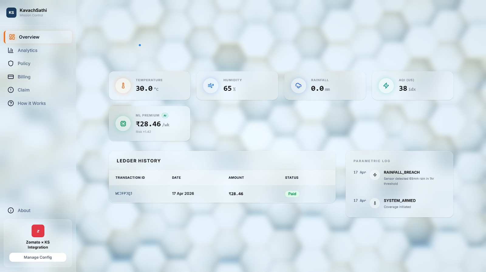
</p>

---

# Admin Dashboard

* Total active users
* Premium collected vs payouts
* Loss ratios
* High-risk zones heatmap
* Fraud alerts
* Predictive analytics for next week weather/disruption claims

<p align="center">
  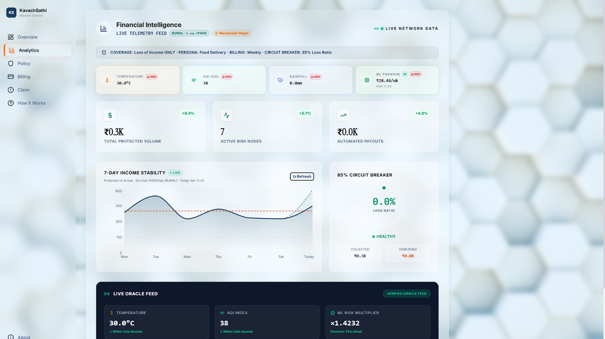
</p>

---

# Zero-Touch Claim Workflow

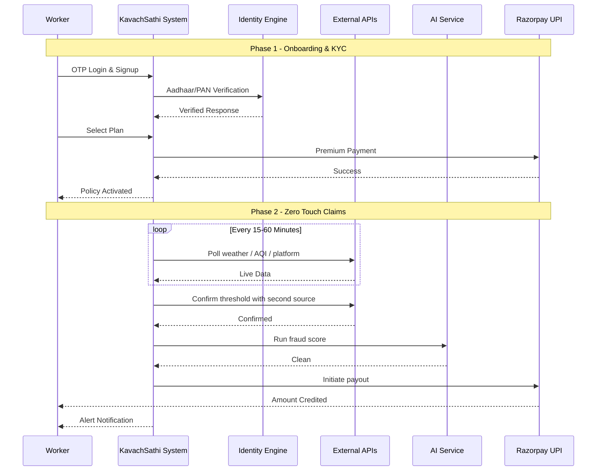

---

# Local Setup & Installation

## Prerequisites

* Node.js v18+
* Python 3.9+
* Git
* FireBase

## Step 1 — Clone Repository

```bash
git clone https://github.com/Victorralph7011/KavachSathi.git
cd KavachSathi
```

## Step 2 — Backend REST Engine

```bash
cd backend
.\venv\Scripts\activate
uvicorn main:app --host 0.0.0.0 --port 8000 --reload
```

## Step 3 — Frontend

```bash
npm install
npm run dev
```

## Step 4 — ML Engine

```bash
cd kavachsathi_ml_engine
.\venv\Scripts\activate
python app.py
```

## Architecture Runtime

```text
Frontend (Next.js)            :3000
Backend REST Engine (FastAPI) :8000
ML Engine (Python)            :5001
FireBase                      :27017
```

---

# IRDAI Compliance

| IRDAI Requirement      | Our Implementation                   |
| ---------------------- | ------------------------------------ |
| Transparent pricing    | Dynamic premium shown before payment |
| Claim audit trail      | Every payout logged with timestamp   |
| Fair treatment         | Rule + AI based equal trigger logic  |
| Fraud prevention       | Multi-signal validation engine       |
| Policy wording clarity | Trigger conditions clearly visible   |
| User notification      | Instant alerts on policy / payout    |

---

# Technology Stack

| Layer    | Technology              |
| -------- | ----------------------- |
| Frontend | React / Next.js         |
| Backend  | Node.js / FastAPI       |
| Database | MongoDB                 |
| AI / ML  | Python / Scikit-learn   |
| APIs     | Weather / Traffic / AQI |
| Payments | Razorpay                |

---

# Development Roadmap

Phase 1 → Concept & Architecture
Phase 2 → Execution & APIs
Phase 3 → Intelligence, Fraud AI, Dashboards, Instant Payouts

---

# Team

| Member              | Role                |
| ------------------- | ------------------- |
| Eashan Darsh        | System Architecture |
| Ved Deshmukh        | Research            |
| Shashwat Chaturvedi | Backend             |
| Sneha Basera        | Data                |
| Asim Shankar        | AI                  |

---

# Vision

KavachSathi transforms insurance into real-time protection.

From claim-based insurance to trigger-based protection.
