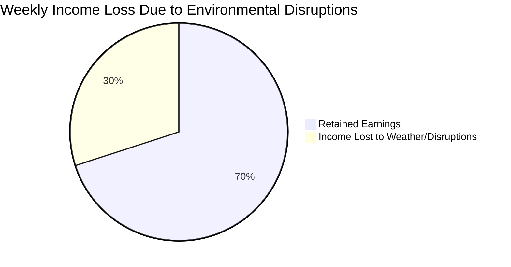
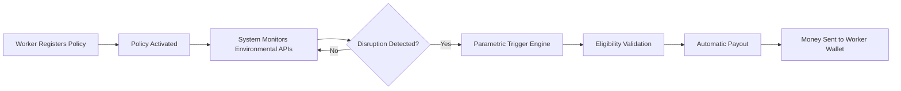
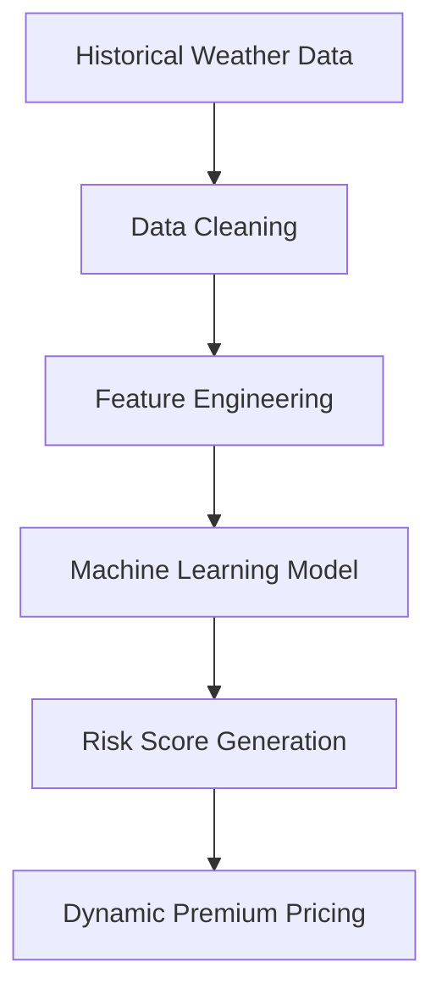
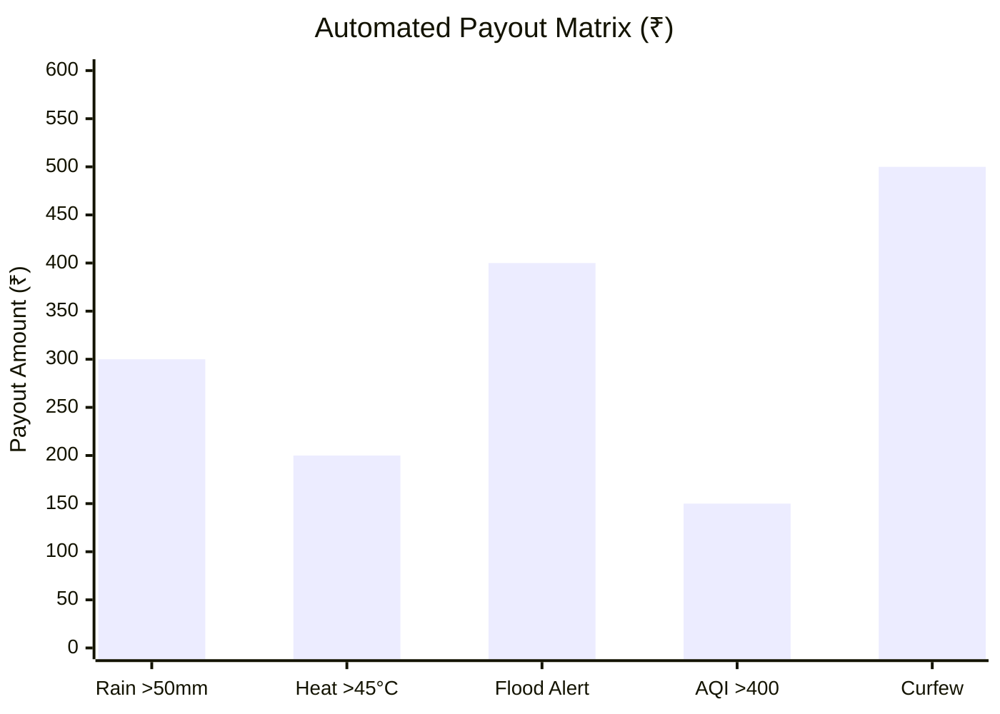

  

  <b>Phase 1 Strategy & System Concept</b> 
  <i>A data-driven safety net for India's gig economy</i>

---

# 📌 Problem Statement

India’s gig economy relies on **delivery partners** who earn daily wages strictly based on completed deliveries.

However, workers face income loss due to **uncontrollable environmental disruptions** such as:

- 🌧 Heavy Rain  
- 🌡 Extreme Heatwaves  
- 🌫 Severe Air Pollution  
- 🚧 Government Curfews  
- 🌊 Flood Alerts  

During such events, workers may lose **20–30% of their weekly income**, and currently there is **no dedicated protection system** for this type of disruption.

---

# Why This Matters

India currently has **7+ million gig workers**, and the number is growing rapidly with platforms like **Swiggy, Zomato, Blinkit, and Zepto**.

Most of these workers depend on **daily earnings to survive**, meaning even **1–2 days of disruption** can significantly affect their financial stability.

Environmental disruptions such as:

- Floods
- Heatwaves
- Severe pollution
- Government restrictions

can **instantly halt deliveries**, leaving workers without income.

ShieldGig aims to create a **financial safety net** that protects gig workers from these unpredictable events through **automated parametric insurance**.

---

# Proposed Concept: ShieldGig

**ShieldGig** is a **parametric micro-insurance platform** designed specifically for gig delivery workers.

Instead of traditional manual claim processes, the system uses **automated environmental triggers** powered by trusted APIs.

When certain environmental thresholds are crossed, **payouts are automatically triggered**.

### Core Idea

If environmental conditions stop gig workers from working, the system **automatically compensates a portion of their lost income.**

---

# Core System Pillars

### 1️ Weekly Micro-Premiums

A subscription model aligned with the **weekly payout cycle** of gig workers.

### 2️ Algorithmic Risk Scoring

Premiums dynamically adjust using:

- Weather forecasts
- Historical disruption data
- Geographic vulnerability analysis

### 3️ Zero-Touch Claims

No paperwork or claim forms.

The system automatically detects disruptions using **external data APIs**.

### 4️ Instant Wallet Payouts

Compensation is credited directly to the **worker’s digital wallet**.

---

# Target User Persona

Phase 1 focuses on **Food Delivery Partners**.

| Category | Details |
|--------|--------|
| Platforms | Swiggy, Zomato |
| Age Group | 18–35 |
| Daily Earnings | ₹600 – ₹900 |
| Payment Cycle | Weekly |

---

# Workflow Scenario

### Example Case

Rahul is a delivery partner earning **₹5000 per week**.

A sudden monsoon flood stops deliveries in his area for **two days**, causing **₹1500 income loss**.

### ShieldGig Protocol

1️ Weather API detects **extreme rainfall**

2️ Parametric trigger validates the condition

3️ System automatically initiates payout

4️ Rahul receives **₹800 compensation instantly**

No manual claim required.

---

# Visual System Workflow

---

# System Architecture

### Architecture Components

**Client Interface**

- Worker dashboard  
- Policy registration  
- Coverage tracking  

**Backend Node**

- Policy management  
- API polling  
- Event monitoring  

**Risk Engine**

- Calculates geographic risk scores  
- Determines dynamic premium pricing  

**Data Oracles**

External data sources:

- OpenWeather API  
- Government AQI APIs  
- Disaster alert systems

**AI Agent**

We will train our own AI agent.

**Trigger Engine**

Evaluates incoming environmental data against **parametric rules**.

**Payment Gateway**

Simulated payout system using **Razorpay Sandbox**.

---

# AI Decision Flow

---

# Parametric Triggers & Payout Logic

These thresholds enable **automated and transparent payouts**.

| Disruption Event | API Condition | Automated Payout |
|---|---|---|
| 🌧 Heavy Rain | Rainfall > 50mm | ₹300 |
| 🌡 Extreme Heat | Temperature > 45°C | ₹200 |
| 🌊 Flood Alert | Government Flood Alert | ₹400 |
| 🌫 Severe Pollution | AQI > 400 | ₹150 |
| 🚧 Curfew | Geo-fenced restriction | ₹500 |

---

# Weekly Premium Model

Premiums are calculated weekly to match the worker’s payment cycle.

| Tier | Weekly Premium | Maximum Coverage |
|----|----|----|
| Basic | ₹20 | Up to ₹1000 |
| Standard | ₹35 | Up to ₹2000 |
| Pro | ₹50 | Up to ₹3500 |

Premiums dynamically adjust based on **location risk score**.

---

# AI & Logic Integration Strategy

### 1️ Risk Prediction Engine

Machine learning models analyze:

- Historical weather patterns  
- Flood-prone regions  
- Seasonal disruptions  

Technologies:

- Python  
- Scikit-learn  

---

### 2️ Dynamic Pricing Logic

Premiums automatically scale according to:

- Geographic risk
- Weather probability
- Disaster likelihood

Lower risk areas → cheaper premiums.

---

### 3️ Fraud Detection

The system prevents abuse by validating:

- GPS location vs disruption zones  
- User reports vs API data  
- Duplicate payout patterns  

---

# Technology Stack

| Layer | Technology |
|------|-----------|
| Frontend | React.js / Next.js |
| Backend | Node.js + Express |
| Database | MongoDB |
| AI / ML | Python, Scikit-learn |
| APIs | OpenWeather API, AQI API |
| Payment Simulation | Razorpay Sandbox |

---

# Development Roadmap

### Phase 1 (Current)

- Concept design  
- Architecture planning  
- Parametric trigger modeling  
- Hackathon submission  

---

### Phase 2

- Backend development  
- API integration  
- Risk engine training  

---

### Phase 3

- Real-time payout automation  
- Fraud detection system  
- Full prototype deployment  

---

# Team

| Member | Role |
|------|------|
| **Eashan Darsh** | System Architecture & Frontend |
| **Ved Deshmukh** | Research |
| **Shashwat Chaturvedi** | Backend |
| **Sneha Basera** | Data Collection |
| **Asim Shankar** | AI / ML |

---

# Vision

ShieldGig aims to become the **first automated income protection system for gig workers**.

As gig economies grow, millions remain financially vulnerable to **environmental disruptions**.

ShieldGig converts insurance into a **real-time, data-driven financial safety net**.
