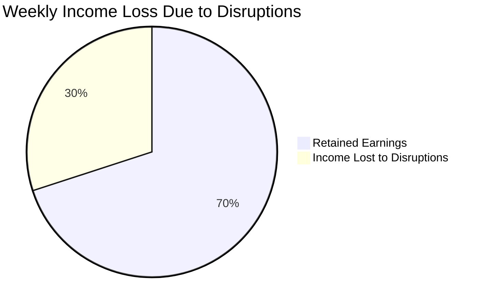
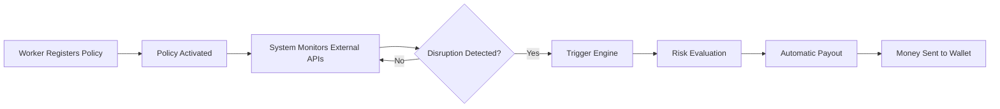
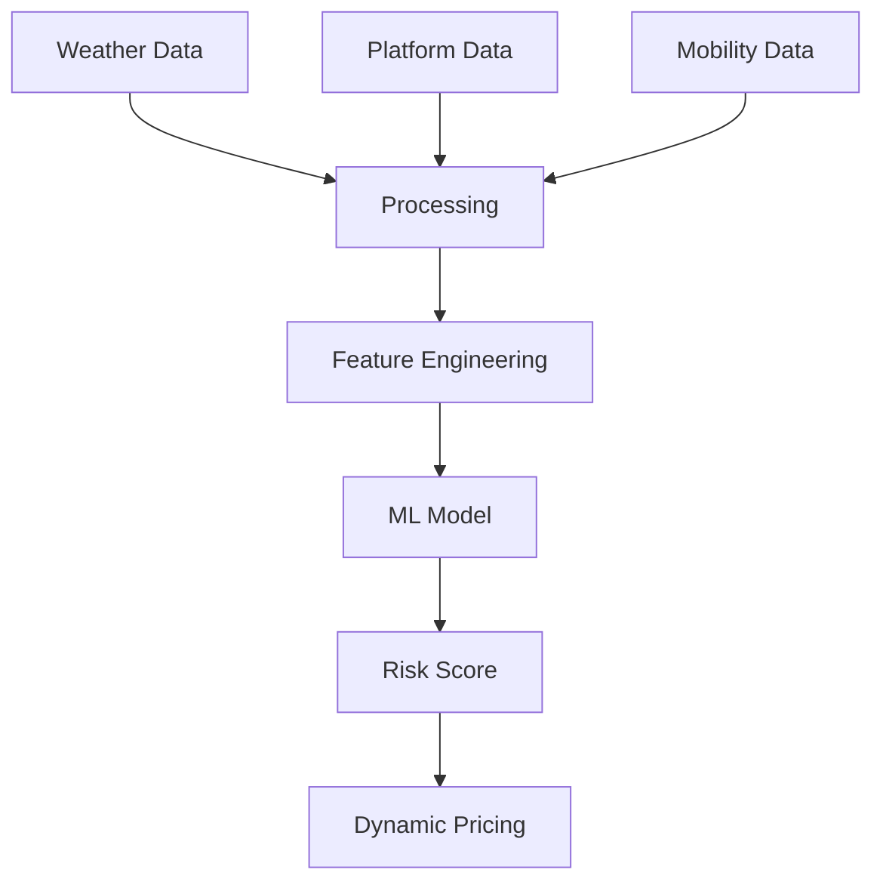
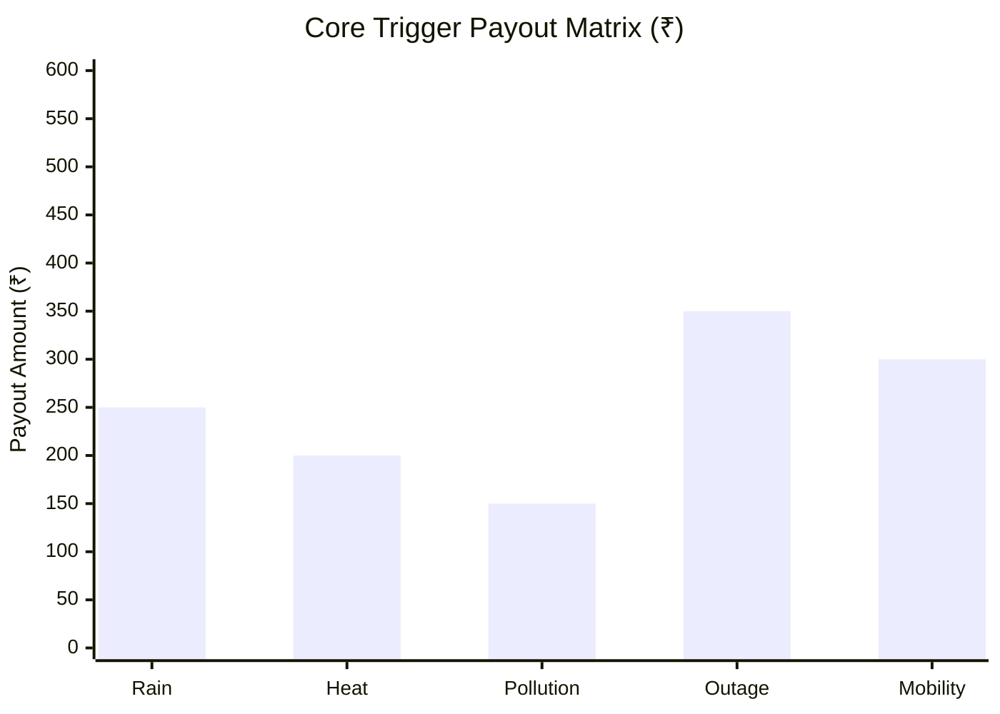

<div align="center">
  
</div>

<p align="center">
  <b>Phase 1 Strategy & System Concept</b><br>
  <i>A data-driven safety net for India's gig economy</i>
</p>

---

# 📌 Problem Statement

India’s gig economy relies on *delivery partners* who earn daily wages strictly based on completed deliveries.

However, workers face income loss due to *uncontrollable external disruptions* such as:

- Heavy Rain  
- Extreme Heatwaves  
- Severe Air Pollution  
- Mobility Restrictions (road blockages, restricted zones)  
- Platform-Level Disruptions  

During such events, workers may lose **20–30% of their weekly income**, and currently there is **no dedicated protection system** for this type of disruption.



---

# Why This Matters

India currently has *7+ million gig workers*, and the number is growing rapidly with platforms like **Swiggy, Zomato, Blinkit, and Zepto**.

Most of these workers depend on *daily earnings to survive*, meaning even **1–2 days of disruption** can significantly affect their financial stability.

Disruptions such as:

- Environmental conditions  
- Platform-level anomalies  
- Mobility restrictions  

can *instantly halt deliveries*, leaving workers without income.

ShieldGig creates a *financial safety net* using automated parametric insurance.

---

# Proposed Concept: ShieldGig

*ShieldGig* is a *parametric micro-insurance platform* designed specifically for gig delivery workers.

Instead of manual claims, the system uses *real-time external data signals* to detect disruptions and trigger payouts automatically.

### Core Idea

If real-world disruptions reduce earning capacity, the system *automatically compensates income loss.*

---

# Core System Pillars

### 1. Weekly Micro-Premiums
Aligned with the *weekly payout cycle* of gig workers.

### 2. Algorithmic Risk Scoring
Premiums dynamically adjust using:

- Weather forecasts  
- Platform activity signals  
- Mobility conditions  

### 3. Zero-Touch Claims
No paperwork. Fully automated detection and payout.

### 4. Instant Wallet Payouts
Direct compensation to worker wallets.

---

# Target User Persona

Phase 1 focuses on *Food Delivery Partners*.

<p align="center">
  
</p>

---

# Workflow Scenario

### Example Case

Rahul is a delivery partner earning *₹5000 per week*.

A disruption reduces his working ability for two days, causing **₹1500 income loss**.

### ShieldGig Protocol

1. System detects external disruption via APIs  
2. Trigger conditions are validated  
3. Risk engine evaluates impact  
4. Automatic payout is initiated  

Rahul receives *₹800 instantly* with zero manual claim.

---

# Visual System Workflow



---

# System Architecture

<p align="center">

</p>

### Architecture Components

*Client Interface*
- Worker dashboard  
- Policy tracking  

*Backend Node*
- API polling  
- Event monitoring  

*Risk Engine*
- Composite risk scoring  
- Dynamic pricing  

*Data Oracles*
- Weather APIs  
- Traffic / mobility data  
- Platform status signals  

*AI Agent*
- Learns historical patterns between disruptions and income loss  
- Adjusts risk weights dynamically  

*Trigger Engine*
- Validates parametric conditions  

*Payment Gateway*
- Simulated payout system  

---

# Decision Engine (Core Innovation)

Unlike traditional rule-based systems, ShieldGig uses a **multi-factor decision model**.

```text
Risk Score =
(Environment Factor × 0.4) +
(Platform Impact × 0.4) +
(Mobility Factor × 0.2)
```

### Payout Logic

```text
Risk > 70 → High Payout  
40–70 → Partial Payout  
< 40 → No Payout  
```

This ensures payouts are based on **actual earning impact**, not just raw events.

---

# AI Decision Flow



---

# Parametric Triggers & Payout Logic



## Trigger Table

| Category | Trigger | Condition | Payout |
|----------|--------|----------|--------|
| Environmental | Heavy Rain | Rainfall > 60mm | ₹250 |
| Environmental | Extreme Heat | Temperature > 45°C | ₹200 |
| Environmental | Pollution | AQI > 400 | ₹150 |
| Platform | Platform Disruption | Abnormal drop in activity / downtime | ₹350 |
| Mobility | Mobility Restriction | Route blockage / restricted zone | ₹300 |

---

# Weekly Premium Model

| Tier     | Weekly Premium | Max Coverage | Per Event Cap |
|----------|---------------|-------------|---------------|
| Basic    | ₹25           | ₹500        | ₹150–₹200     |
| Standard | ₹40           | ₹1000       | ₹250–₹300     |
| Pro      | ₹60           | ₹1800       | Up to ₹400    |

Premiums dynamically adjust based on **risk score and location conditions**.

---

# AI & Logic Integration

### Risk Prediction
- Weather patterns  
- Platform disruptions  
- Mobility data  

### Dynamic Pricing
- Risk score driven  
- Area-based adjustments  

### Fraud Detection
- Location validation  
- API cross-verification  
- Anomaly detection  

---

# Technology Stack

| Layer | Technology |
|------|-----------|
| Frontend | React.js / Next.js |
| Backend | Node.js + Express |
| Database | MongoDB |
| AI / ML | Python, Scikit-learn |
| APIs | Weather, Traffic, Platform APIs |
| Payments | Razorpay Sandbox |

---

# Development Roadmap

### Phase 1
- Concept + architecture  
- Trigger modeling  

### Phase 2
- API integration  
- Risk engine  

### Phase 3
- Automation  
- Fraud detection  
- Deployment  

---

# Team

| Member | Role |
|------|------|
| *Eashan Darsh* | System Architecture & Frontend |
| *Ved Deshmukh* | Research |
| *Shashwat Chaturvedi* | Backend |
| *Sneha Basera* | Data Collection |
| *Asim Shankar* | AI / ML |

---

# Vision

ShieldGig aims to become the *first automated income protection system for gig workers*.

It transforms insurance into a **real-time, intelligent, and data-driven safety net**.
